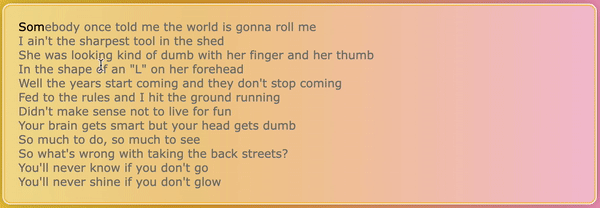

# Typaoke



Just a simple JavaScript module to emulate the behavior of an online typing game, or as the name suggests, a karaoke scroll-sub (but with typing).

[Live Demo](https://par5ul1.github.io/typaoke/demo)

## Setup

The code only depends on jQuery, so you can include that in your project however you prefer.

Once you have jQuery, the module itself is super lightweight and you can just include the source in your HTML's `<head>` and you're good to go. To ensure that the module runs after the page has fully loaded, you can use a defer attribute like so:

``` html
<!-- jQuery include should go here -->
<script src="src/typaoke.min.js" defer></script>
```

If this gains *some* traction, I will probably host it on npm and some cdn aggregator out there but for now you can just use the [raw GitHub link](https://raw.githubusercontent.com/par5ul1/typaoke/master/src/typaoke.min.js) or download the source in your own project.

## Usage

You just need some focusable element (I used a `div`) with the class `typaoke` and some other element capable of holding text (such as a `p`) with the class `typaoke_content`. Then you just place your text in `typaoke_content` and the script manipulates your HTML to make everything work.

Feel free to use the example code below:
``` html
<div class="typaoke">
  <p class="typaoke_content">
    ...
  </p>
</div>
```

Now, if you click on the container and start typing, everything should work. You may, however, notice that nothing seems to be happening. That is because you still need to style the untyped and typed versions of the text to look different (right now they should all look black).

In your CSS, you can style the untyped text by targeting the `typaoke_untyped` class and you can style the typed text with the `typaoke_typed` class. Feel free to style your `typaoke` container however you want.

Also for your convenience, I am exposing a boolean variable called `typaokeReachedEnd` which will just tell you when you have fully finished typing the text, in case you want something to happen when you do.
